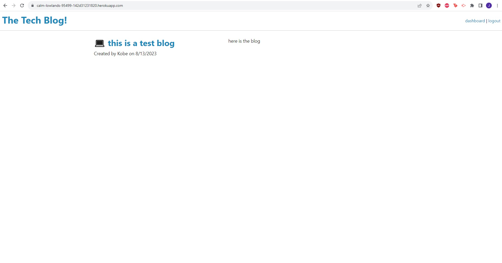

# e-commerce-back-end

## Description

This program allows you to post blogs on the website!

1. Create an account by signing up with  your name, email, and password! To sign up, click the login button at the top right, and at the bottom you should get a link to sign up instead!
2. Once you create an account, you're able to post blogs by clicking dashboard!
3. You'll be taken to the "Create a new blog" page, and you just have to write the title of the blog post, and the description, then click create!
4. Once created, you'll see that it's added to the list of your current blogs, as well as the home page. You can either delete the blog, or update the blog in your dashboard page!
5. If you click on other people's blogs, you should be able to leave comments!

## Installation

You can install the tech-blog application on github here

https://github.com/Rockojoe2/tech-blog

You can visit the deployed website using Heroku here!

https://calm-lowlands-95499-142d31231820.herokuapp.com/

## Credits
UTA class folder

Worked with classmates May Pham (https://github.com/mayphamx) and Mica Villanueva(https://github.com/micavilla) 

## License

MIT License

---